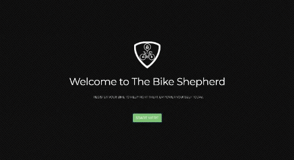

# The Bike Shepherd

## Have You Ever Gotten Your Bike Stolen?

- If you answered, yes, then The Bike Shepherd is what you need!

[The Bike Shepherd](https://bike-shepherd.herokuapp.com/) is a website and mobile app that empowers bicycle owners to prevent bicycle theft and aid in the recovery of stolen bicycles. The App uses Node.js and Express Web Frameworks, Handlebars and Sequelize ORM. The App logs all bikes registered and marked stolen. It uses MySQL to query and route data to the App and Handlebars to generate the HTML. The website provides resources to to help you recover your stolen bike.
 

## Getting Started

- Clone Repo
- Run command in Terminal "npm install"
- Run command "npm start"
- Run "ctrl + c" to exit mode

## Empower Yourself & Register Your Bike Today!

## Technologies Utilized

- CSS3
    - Bootstrap 4.2.1
- JavaScript
    - Node.js
        - Express
        - Body-Parser
        - Connect-Ensure-Login
        - Cookie-Parser
        - Express-Handlebars
        - MySQL
        - Morgan
        - Passport
        - Sequelize
- Database
    - MySQL2
- Testing
    - Chai
    - Chai-http
    - Eslint
    - Mocha
    - Prettier
    - Travic CI
- Deployment
    - Heroku

## Mobile Responsive

## License & Copyright

&copy; Scott Ratigan, Susye Weng-Reeder, Michael Whittemore, James Wilcox: The Bike Shepherd 2019. UC Berkeley Coding Bootcamp.